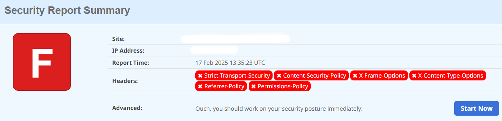
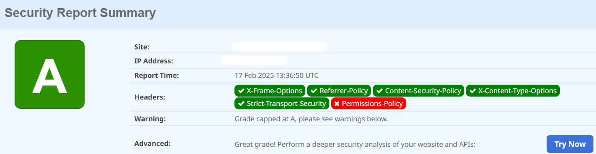

***This guide provides an overview of reconnaissance techniques and tools used for penetration testing and security research.***  <br />

***Below are my security-related configuration settings for AWS CloudFront.***

# Passive reconnaissance <br />
**Passive reconnaissance** is a process of gathering information about the target without directly interacting with it.  <br />

## Common Passive Reconnaissance Techniques: <br />

▪ **Scanning DNS**  (Identifying domain records and subdomains); <br />
▪ **Social Media Intelligence (SOCMINT)** - Collecting publicly available information, such as usernames, email addresses, and job roles (This can lead to: Password spraying, Phishing, Privilege Escalation, etc);  <br />


# Passive Reconnaissance Tools <br />

1. **Discover** is a collection of reconnaissance tools requiring API keys for full functionality.
https://github.com/leebaird/discover <br />
 
### Installing and Running Discover

```sh
sudo git clone https://github.com/leebaird/discover
cd /opt/discover/
sudo ./discover.sh
```

2. **Maltego** https://www.maltego.com/ - is a powerful data collection tool supporting both passive and active reconnaissance  <br />
3. **OSINT Framework** https://osintframework.com/ - provides an extensive list of tools for open-source intelligence gathering <br />


# Active reconnaissance <br />

Active reconnaissance involves direct interaction with the target to gather information, often leaving traces in logs.  <br />

## Common Active Reconnaissance Techniques: <br />

▪ **Ports scanning** – Identifying open ports and services (e.g., **nmap, masscan** );  <br />
▪ **Vulnerabilitiy scanning** – Assessing security weaknesses (e.g., **Nessus, BurpSuite**);  <br />
▪ **Directory brute-forcing** – Enumerating hidden files and directories (e.g., **Gobuster, Dirb**);  <br />


# Active Reconnaissance Tools
While some tools like **Maltego** and **Discover** support both passive and active reconnaissance, there are additional specialized tools for active reconnaissance: <br />
▪ **Nmap**  - – Network discovery and security auditing; <br />
▪ **Netcat (nc)** – Simple yet powerful networking utility for service enumeration <br />
▪ **Nikto** – Web vulnerability scanner for identifying misconfigurations and security flaws;  <br />
▪ **Gobuster / dirb** – Brute-force enumeration tools for discovering hidden directories and files;  <br />


## Vulnerability Discovery Tools and Techniques  <br />

### 1. Nessus  <br />
[Nessus](https://www.tenable.com/products/nessus) is widely used for vulnerability assessments, particularly in infrastructure security.  <br />

### 2. SearchSploit / Exploit-DB  <br />
[Exploit-DB](https://www.exploit-db.com/) enables users to search for known vulnerabilities in outdated services.  <br />

### 3. SQLmap  <br />
[SQLmap](https://github.com/sqlmapproject/sqlmap) automates SQL injection discovery and exploitation. It supports direct integration with BurpSuite for testing HTTP requests.  <br />

### 4. BurpSuite  <br />
[BurpSuite](https://portswigger.net/burp) is a web security testing tool that acts as an HTTP proxy, allowing interception and modification of web traffic.  <br />


## Analyzing Vulnerabilities  <br />

### 1. SQL Injection  <br />
Allows attackers to manipulate database queries.  <br />
- Lab: [PortSwigger SQL Injection](https://portswigger.net/web-security/sql-injection/lab-retrieve-hidden-data)  <br />

### 2. Cross-Site Scripting (XSS)  <br />
Enables the execution of arbitrary JavaScript in a victim’s browser.  <br />
- Simple payload: `<script>alert(‘1’);</script>`  <br />
- Lab: [XSS Vulnerability](https://portswigger.net/web-security/cross-site-scripting/reflected/lab-html-context-nothing-encoded)  <br />
- More details: [XSS Payload List](https://github.com/payloadbox/xss-payload-list)  <br />

### 3. OS Command Injection  <br />
Allows attackers to execute arbitrary system commands.  <br />
- More details: [Command Injection Payloads](https://github.com/payloadbox/command-injection-payload-list)  <br />
- Lab: [OS Command Injection](https://portswigger.net/web-security/os-command-injection/lab-simple)  <br />

### 4. Directory Traversal  <br />
Grants unauthorized access to local files on a system.  <br />
- Lab: [Path Traversal](https://portswigger.net/web-security/file-path-traversal/lab-simple)  <br />

### 5. Access Control Vulnerabilities  <br />
Allows unauthorized access to restricted resources.  <br />
- Lab: [Bypassing Access Controls](https://portswigger.net/web-security/access-control/lab-unprotected-admin-functionality)  <br />

### 6. File Upload Vulnerabilities  <br />
Enables attackers to upload malicious files for remote execution.  <br />
- Lab: [File Upload RCE](https://portswigger.net/web-security/file-upload/lab-file-upload-remote-code-execution-via-web-shell-upload)  <br />

## Privilege Escalation  <br />
- **LinPEAS** – [Privilege escalation auditing script](https://linpeas.sh/).  <br />
- **GTFOBins** – [List of Unix binaries that allow privilege escalation](https://gtfobins.github.io/).  <br />


## Metasploit  <br />
[Metasploit Framework](https://www.metasploit.com/) is an advanced penetration testing platform for developing, testing, and executing exploits.  <br />


# The following are my CloudFront security configuration settings.

I enabled the protection and configured all the headers in CloudFront. Below is the description for every single header that I was working on and its benefits.  <br />
**<ins>1. Strict-Transport-Security enforces HTTPS-only connections:</ins>**  <br />
***•	Thwarts Man-in-the-Middle Attacks:*** Enforces encryption;  <br />
***•	Secures Subdomains:*** Protects the whole domain ecosystem;  <br />
***•	Preloaded by Browsers:*** Strengthens HTTPS adoption globally.  <br />
 
**<ins>2. X-Content-Type-Options:</ins>**  <br />
***•	Prevents Cross-Site Scripting (XSS):*** Blocks malicious files disguised as safe content;  <br />
***•	Improves Security:*** Stops execution of unintended file types, especially JavaScript;  <br />
***•	Standards Compliance:*** Ensures that browsers respect the server’s declared file type.  <br />
     This implies that the server explicitly overrides default behavior, ensuring the policy applies regardless of user agent or intermediate proxies. <br />
 
**<ins>3. X-Frame-Options Policy:</ins>**  <br />
***•	Prevents Clickjacking Attacks:*** Blocks malicious sites from embedding your content in invisible frames to trick users into interacting with it;  <br />
***•	Restricts Framing to Trusted Sources:*** Ensures only same-origin contexts can embed your pages, maintaining content control;  <br />
***•	Improves Security:*** Mitigates risks of unauthorized framing that could be used to exploit user interactions.  <br />
 
**<ins>4.X-XSS-Protection Policy:</ins>** <br />
***•	Protects Against XSS Attacks:*** Blocks malicious scripts that could compromise user data or site functionality.  <br />
***•	Prevents Content Rendering:*** Stops pages with detected XSS payloads from being displayed.  <br />
***•	Simple Implementation:*** Easy way to add an extra layer of defense for older browsers.  <br />
 
**<ins>5. Referrer-Policy: no-referrer:</ins>**  <br />
Ensures that the policy is strictly applied, overriding defaults or intermediary settings that might otherwise allow referrer information to leak.  <br />
***• Maximized Privacy:*** Prevents sensitive information (e.g., URLs with tokens or user-specific data) from being shared with third-party sites;  <br />
• ***Enhanced Security:*** Avoids exposing site structure or user navigation details to potentially malicious or untrusted endpoints;  <br />
• ***Simplicity:*** Eliminates potential misconfiguration issues by refusing to send any referrer data. <br />
This policy is suitable for sites prioritizing user privacy and security, such as banking or healthcare portals.  <br />
 
**<ins>6. Content-Security-Policy (CSP):</ins>**  <br /> 
• ***Clickjacking Protection:*** By restricting framing to the same origin with frame-ancestors 'self', you prevent malicious websites from embedding your content within a hidden iframe and tricking users into performing unintended actions.  <br />
• ***Controlled Script Loading:*** The script-src-elem directive allows only trusted sources to execute JavaScript, reducing the risk of cross-site scripting (XSS) attacks. Limiting script sources to 'self' and a trusted third-party domain like maps.googleapis.com minimizes the attack surface for malicious scripts.  <br />
• ***Enhanced Security:*** With the combination of these rules, you are enforcing a more secure environment where the resources loaded and interactions allowed are carefully controlled.  <br />

## By implementing these configurations, I have successfully improved the overall scanning score from 'F' to 'A'.






**You can find more about it in the [cloudfront_security_headers_policy.tf](cloudfront_security_headers_policy.tf) file within this repo.**